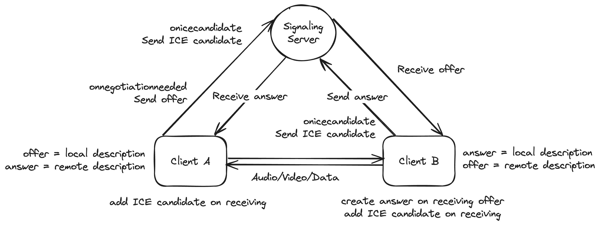

# WebRTC Video Chat Demo

This is a basic WebRTC video chat demo using Vite, React and Koa.

## Prerequisites

- [Node.js](https://nodejs.org) (v20)
- [Yarn](https://yarnpkg.com)

## Getting Started

1. Install dependencies

   ```sh
   yarn
   ```

2. Start the server

   ```sh
   yarn dev

   ```

3. Open the browser and navigate to `http://localhost:5173`

## Tunneled Server

To be able to test the video chat demo on different devices, you can use a tunneled server such as [Cloudflare](https://developers.cloudflare.com/pages/how-to/preview-with-cloudflare-tunnel/) or [ngrok](https://ngrok.com/).

Example:

```sh
cloudflared tunnel --url http://localhost:5173
```

## Basic Concepts

WebRTC is a browser API that allows for real-time peer-to-peer communication between browsers. It can be used to stream audio and/or video media, as well as to exchange arbitrary data between browsers.

### STUN Servers

STUN (Session Traversal Utilities for NAT) servers are used to discover the public IP address of a peer. This is necessary to establish a connection between two peers, as they need to know each other's public IP addresses to send media to each other.

There are free public STUN servers available, such as `stun:stun.l.google.com:19302`.

### TURN Servers

TURN (Traversal Using Relays around NAT) servers are used to relay media between peers when a direct connection cannot be established. This is necessary when peers are behind restrictive firewalls or NATs that prevent direct connections.

### Peer Connection

A peer connection is a direct connection between two peers. It is used to send and receive media, as well as to exchange arbitrary data.

It can be established using the `RTCPeerConnection` API, which is used to create, configure, and manage peer connections.

```js
const peerConnection = new RTCPeerConnection({
  iceServers: [
    {
      urls: ['stun:stun1.l.google.com:19302', 'stun:stun2.l.google.com:19302'],
    },
  ],
});
```

### ICE Candidates

ICE (Interactive Connectivity Establishment) is a protocol used to establish a connection between two peers. It is used to discover the best path for media to travel between peers, and to establish a connection using that path.

ICE candidates are used to exchange information about the best path for media to travel between peers. They contain information about the peer's IP address, port, and other properties.

It is available in the `onicecandidate` event of the `RTCPeerConnection` API.

```js
peerConnection.onicecandidate = (event) => {
  if (event.candidate) {
    // Send the ICE candidate to the other peer
  }
};
```

### Session Descriptions

Session descriptions are used to describe the media being sent between peers. They contain information about the media's format, codec, and other properties.

There are two types of session descriptions:

- Offer: Describes the media being sent by the peer. It can be created using the `createOffer` method of the `RTCPeerConnection` API.
- Answer: Describes the media being received by the peer. It can be created using the `createAnswer` method of the `RTCPeerConnection` API.

Session descriptions can be exchanged using any protocol, such as WebSocket, HTTP, or others.

```js
const offer = await peerConnection.createOffer();

await peerConnection.setLocalDescription(offer);

// Send the offer to the other peer
```

### Media Stream

A media stream is a stream of audio and/or video data. It can be sent and received using a peer connection.

For a video call, we have 2 types of media streams:

- Local Media Stream: The media stream sent by the peer. It can be captured using the `getUserMedia` API.
- Remote Media Stream: The media stream received by the peer. It can be received using the `ontrack` event of the `RTCPeerConnection` API.

```js
// Capture the local media stream
const localStream = await navigator.mediaDevices.getUserMedia({
  video: true,
  audio: true,
});

// Send the local media stream to the other peer
localStream.getTracks().forEach((track) => {
  peerConnection.addTrack(track, localStream);
});

peerConnection.ontrack = (event) => {
  const remoteStream = event.streams[0];

  // Display the remote media stream
};
```

### Data Channel

A data channel is a channel used to exchange arbitrary data between peers. It can be used to send and receive messages, files, and other data.

It can be established using the `createDataChannel` method of the `RTCPeerConnection` API.

```js
const dataChannel = peerConnection.createDataChannel('chat');

// Send a message to the other peer
dataChannel.send('Hello, world!');

// Receive messages from the other peer
peerConnection.ondatachannel = (event) => {
  const dataChannel = event.channel;

  if (dataChannel.label === 'chat') {
    dataChannel.onmessage = (event) => {
      console.log(event.data);
    };
  }
};
```

### Signaling Server

WebRTC requires a signaling server to exchange metadata between peers. This server is used to exchange session descriptions, ICE candidates, and other information necessary to establish a peer-to-peer connection.

The signaling server can be implemented using any protocol, such as WebSocket, HTTP, or others. In this demo, we use a basic WebSocket server.

## Timeline

The following is a high-level overview of the steps involved in the video chat demo using WebRTC:



- Client A:
  1. Create a WebSocket connection to the signaling server
  2. Acquire the local media stream using `getUserMedia`
  3. Create a peer connection
  4. Add the local media stream to the peer connection
  5. Create an offer and set it as the local description of the peer connection
  6. Send the offer to the other peer (Client B) using the signaling server
  7. Receive the answer from the other peer (Client B) using the signaling server
  8. Set the answer as the remote description of the peer connection
  9. Exchange ICE candidates with the other peer using the signaling server
  10. Add the remote media stream to the peer connection
  11. Display the media streams
- Client B:
  1. Create a WebSocket connection to the signaling server
  2. Acquire the local media stream using `getUserMedia`
  3. Create a peer connection
  4. Add the local media stream to the peer connection
  5. Receive the offer from the other peer (Client A) using the signaling server
  6. Set the offer as the remote description of the peer connection
  7. Create an answer and set it as the local description of the peer connection
  8. Send the answer to the other peer (Client A) using the signaling server
  9. Exchange ICE candidates with the other peer using the signaling server
  10. Add the remote media stream to the peer connection
  11. Display the media streams

## Requirements

- Build an app that allows two users to communicate with each other using WebRTC. It could be a video, audio, text etc. or a combination of these.
- The app must use the WebRTC APIs without any third-party libraries.
- Come up with an idea for the type of app as well as think of features. Some examples:
  - Video call
  - Audio call
  - Text chat
  - File sharing
  - Screen sharing
  - Canvas drawing board
  - Multiple participants
  - Usernames and rooms
- If you are stuck, you can refer to the sample code in this repository.

## Resources

- [WebRTC API](https://developer.mozilla.org/en-US/docs/Web/API/WebRTC_API)
- [WebRTC in 100 Seconds (with Firebase)](https://www.youtube.com/watch?v=WmR9IMUD_CY)
- [Perfect negotiation in WebRTC](https://developer.mozilla.org/en-US/docs/Web/API/WebRTC_API/Perfect_negotiation)
- [WebRTC Samples](https://webrtc.github.io/samples/)
- [WebRTC.org by Google](https://webrtc.org/)
